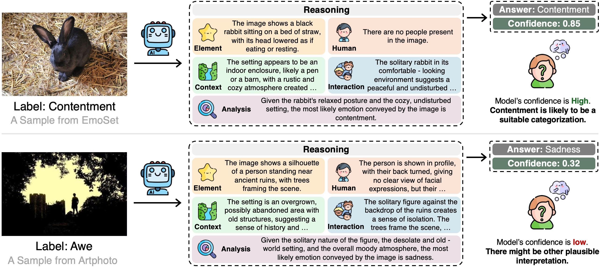
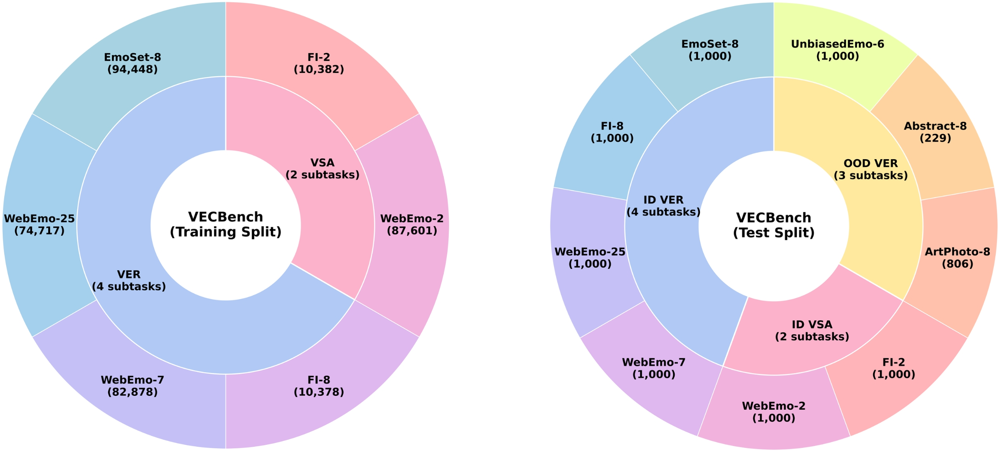
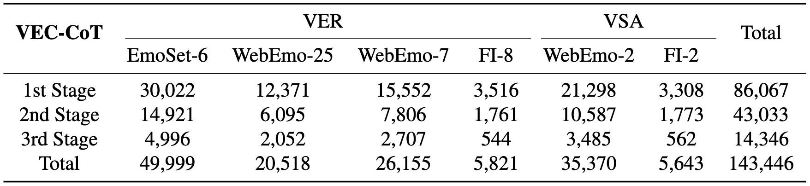
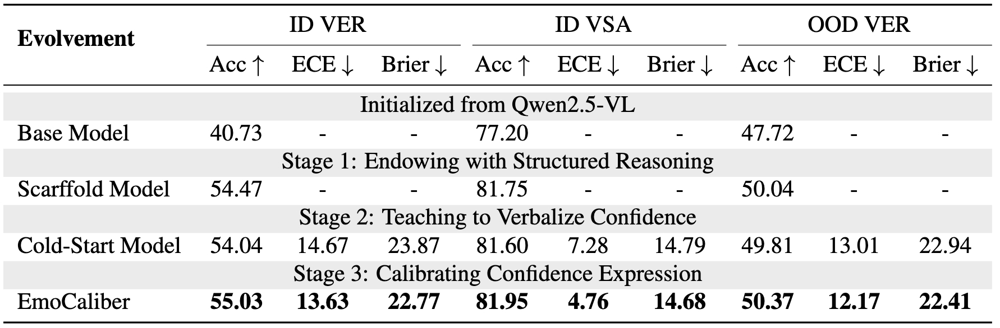

# EmoCaliber

Project page of:\
**EmoCaliber: Advancing Reliable Visual Emotion Comprehension via Confidence Verbalization and Calibration**\
*Daiqing Wu, Dongbao Yang, Can Ma, Yu Zhou*

## 📖 Overview  

This repository provides the **code and data** introduced in our [paper](https://arxiv.org/abs/2512.15528), consisting of five key components:

- **EmoCaliber**: A confidence-calibrated MLLM for Visual Emotion Comprehension (VEC). Link: [https://huggingface.co/wudq/EmoCaliber](https://huggingface.co/wudq/EmoCaliber).

   
   

   <em>Figure 1: Example of EmoCaliber performing VEC.</em>
   

   
- **VECBench**: A unified benchmark for VEC that comprises six popular datasets. Link: [https://huggingface.co/datasets/wudq/VECBench](https://huggingface.co/datasets/wudq/VECBench).

   

     
      
     <em>Figure 2: Task composition of VECBench.</em>
   

   
- **VEC-CoT**: A dataset with high-quality image-label-CoT triplets. Link: [https://huggingface.co/datasets/wudq/VECBench/tree/main/VEC-CoT](https://huggingface.co/datasets/wudq/VECBench/tree/main/VEC-CoT).

   

     
      
     <em>Figure 3: Statistics of VEC-CoT dataset.</em>
   

  
- **Evaluation Code**: Code for performing inference and evaluation on VECBench.

   

     
      
     <em>Figure 4: Performance of EmoCaliber.</em>
   

- **Training Script**: The scripts we used to train EmoCaliber based on ms-swift (for stage 1,2) and verl (stage 3). 

   

     
      
     <em>Figure 5: Three stage training framework.</em>
   

---

## ⚙️ Environment

Run `pip install -r requirement.txt` to install dependencies. Note that not all packages in `requirement.txt` are necessary. It is recommended to first install the core dependencies (`torch==2.7.1, flash_attn==2.8.1, transformers==4.57.0, vllm==0.10.0`), followed by the remaining packages.

This environment directly support evaluation and stage 3 training (RL). For stage 1&2, we include additonal dependencies in their training script.

---

## 🧪 Testing / Evaluation

We provide scripts for running inference and evaluating models (capable of verbalizing confidence) on VECBench.

1. Download the model, for example, EmoCaliber from [https://huggingface.co/wudq/EmoCaliber](https://huggingface.co/wudq/EmoCaliber).
2. Go to `inference/infer_and_eval_example.sh`. Set `cur_path` to the path of this directory, `checkpoint` to the path of targeted model, and `n_gpu` to your gpu number.
3. Run `bash inference/infer_and_eval_example.sh`. This will create a folder named `$experiment_name` in `infer_results` and store inference results and evaluation metrics in there.
4. There should be a `metric.log` and a `metric_conf.log` with tables like below:
   <pre>
     In metric.log:
    -----------------------------------------------------
    | Task            | Acc      | F1       | #Samples  |
    -----------------------------------------------------
    | Abstract-8      |  29.26 |  29.94 | 229       |
    | Artphoto-8      |  41.94 |  41.84 | 806       |
    | EmoSet-8        |  68.10 |  67.72 | 1000      |
    | FI-2            |  88.10 |  88.16 | 1000      |
    | FI-8            |  69.70 |  70.00 | 1000      |
    | UnbiasedEmo-6   |  79.90 |  80.41 | 1000      |
    | WebEmo-2        |  75.80 |  75.78 | 1000      |
    | WebEmo-7        |  54.00 |  52.81 | 1000      |
    | WebEmo-25       |  28.28 |  24.28 | 997       |
    -----------------------------------------------------
    | Overall         |  61.35 |  61.32 | 8032      |
    -----------------------------------------------------
     In metric_conf.log:
    --------------------------------------------------------------------------------------
    | Task/Group      | Acc    | F1     | ECE      | Brier      | ROC AUC    | #Samples  |
    --------------------------------------------------------------------------------------
    | Abstract-8      |  29.26 |  29.94 | N/A      | N/A        | N/A        | 229       |
    | Artphoto-8      |  41.94 |  41.84 | N/A      | N/A        | N/A        | 806       |
    | EmoSet-8        |  68.10 |  67.72 | N/A      | N/A        | N/A        | 1000      |
    | FI-2            |  88.10 |  88.16 | N/A      | N/A        | N/A        | 1000      |
    | FI-8            |  69.70 |  70.00 | N/A      | N/A        | N/A        | 1000      |
    | UnbiasedEmo-6   |  79.90 |  80.41 | N/A      | N/A        | N/A        | 1000      |
    | WebEmo-2        |  75.80 |  75.78 | N/A      | N/A        | N/A        | 1000      |
    | WebEmo-7        |  54.00 |  52.81 | N/A      | N/A        | N/A        | 1000      |
    | WebEmo-25       |  28.28 |  24.28 | N/A      | N/A        | N/A        | 997       |
    --------------------------------------------------------------------------------------
    | ID VSA          |  81.95 |  81.75 |     4.76 |      14.68 |      66.09 | 2000      |
    | ID VER          |  55.04 |  53.96 |    13.63 |      22.77 |      70.90 | 3997      |
    | OOD VER         |  59.16 |  59.79 |    12.17 |      22.41 |      72.17 | 2035      |
    --------------------------------------------------------------------------------------
    | Overall         |  61.35 |  61.32 | N/A      | N/A        | N/A        | 8032      |
    --------------------------------------------------------------------------------------
   </pre>
  
---

## 🚀 Training

The training of EmoCaliber consists of three stages. We provide a script template for each of them in `train`.

To prepare training, please first download VEC-CoT dataset from [https://huggingface.co/datasets/wudq/VECBench/tree/main/VEC-CoT](https://huggingface.co/datasets/wudq/VECBench/tree/main/VEC-CoT).

Stage 1: Endowing with structured reasoning.

1. Download Qwen2.5-VL-7B checkpoint from [https://huggingface.co/Qwen/Qwen2.5-VL-7B-Instruct](https://huggingface.co/Qwen/Qwen2.5-VL-7B-Instruct).
2. We adopt [ms-swift](https://github.com/modelscope/ms-swift) framework for SFT. First download their repositories.
3. Go to `train/step1_example.sh`. Set `swift_path` to path to ms-swift directory, and `/path/to/base/model (for --model)` to qwen2.5-vl path.
4. Set `/path/to/sft_data (for --dataset)` to path to `VEC-CoT/stage1_86k.jsonl`, and `/path/to/save/your/checkpoint` to your desired path.
5. Run `bash train/step1_example.sh`.

Stage 2: Teaching to verbalize confidence.

1. Go to `train/step2_example.sh`. Set `swift_path` to path to ms-swift directory, and `/path/to/scaffold/model (for --model)` to the obtained stage1 model path.
2. Set `/path/to/sft_data (for --dataset)` to path to `VEC-CoT/stage2_43k_w_conf.jsonl`, and `/path/to/save/your/checkpoint` to your desired path.
3. Run `bash train/step2_example.sh`.

Stage 3: Calibrating confidence expression.

1. We adopt [verl](https://github.com/volcengine/verl) framework for RL. First download their repositories.
2. Go to `train/step3_example.sh`. Set `verl_path` to path to verl directory, and `/path/to/cold/start/model (for actor_rollout_ref.model.path)` to obtained stage2 model path.
3. Prepare `.parquet` format file for train and val. `train.parquet` can converted from `VEC-CoT/stage3_14k.jsonl`, `val.parquet` can use test split (or a subset). Please refer to [document](https://verl.readthedocs.io/en/latest/) for required parquet format. Set `/path/to/train/parquet` and `/path/to/val/parquet` accordingly.
4. Copy `train/cus_reward.py` to `your_verl_path/verl/utils/reward_score/` and modify `your_verl_path/verl/utils/reward_score/__init__.py` to match your data_source.
5. The obtained model will be stored in `verl/checkpoints/$project_name/$experiemnt_name` by default.

---

## 📌 Citation
If you find this work useful, please consider citing our paper:
<pre>
@article{wu2025emocaliber,
  title   = {EmoCaliber: Advancing Reliable Visual Emotion Comprehension via Confidence Verbalization and Calibration},
  author  = {Wu, Daiqing and Yang, Dongbao and Ma, Can and Zhou, Yu},
  journal = {arXiv preprint arXiv:2512.15528},
  year    = {2025}
}
